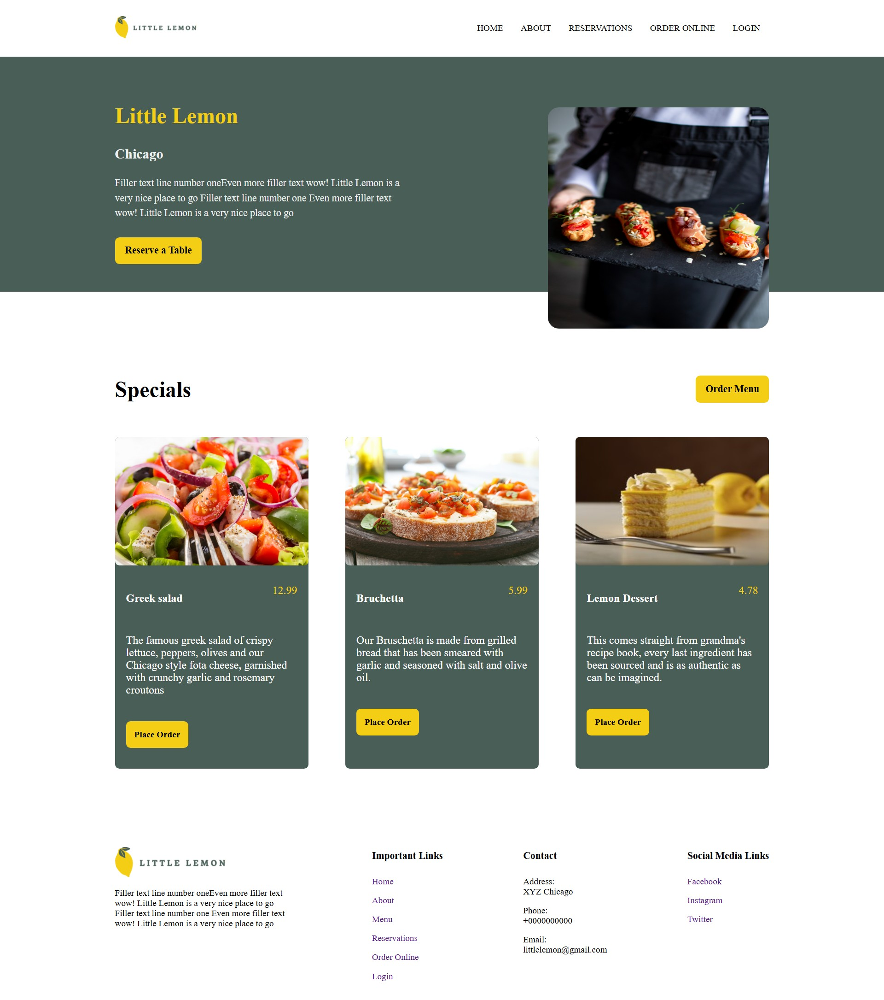
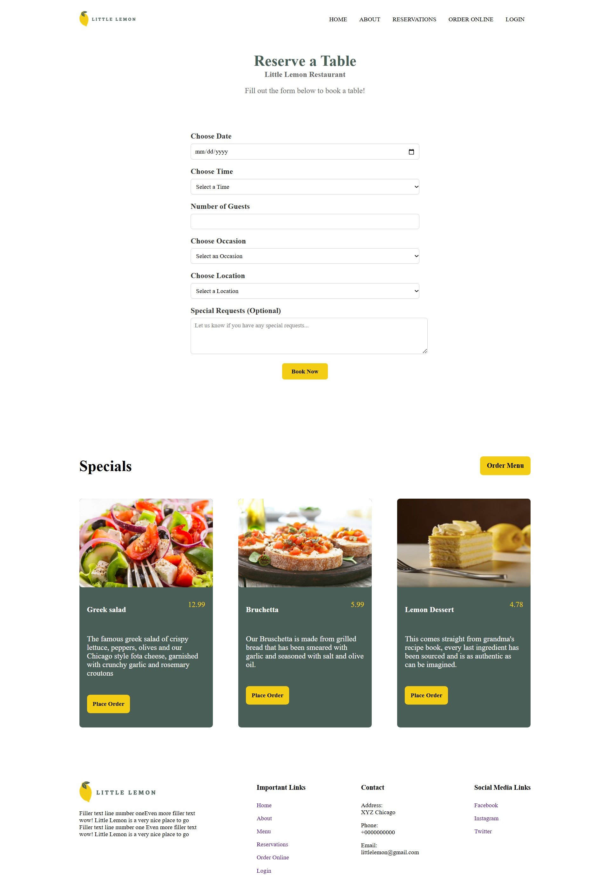
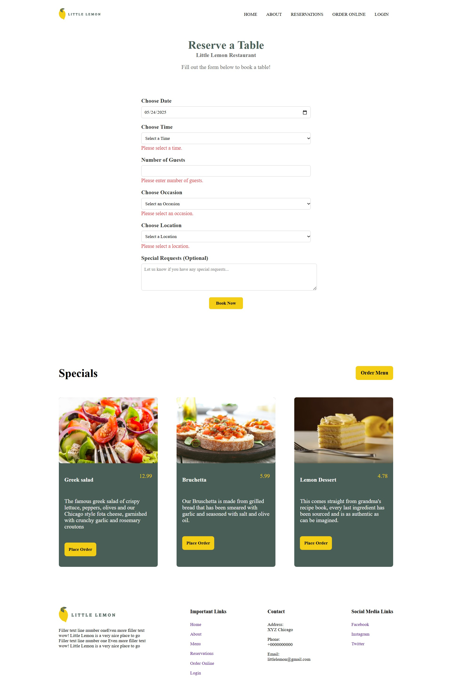
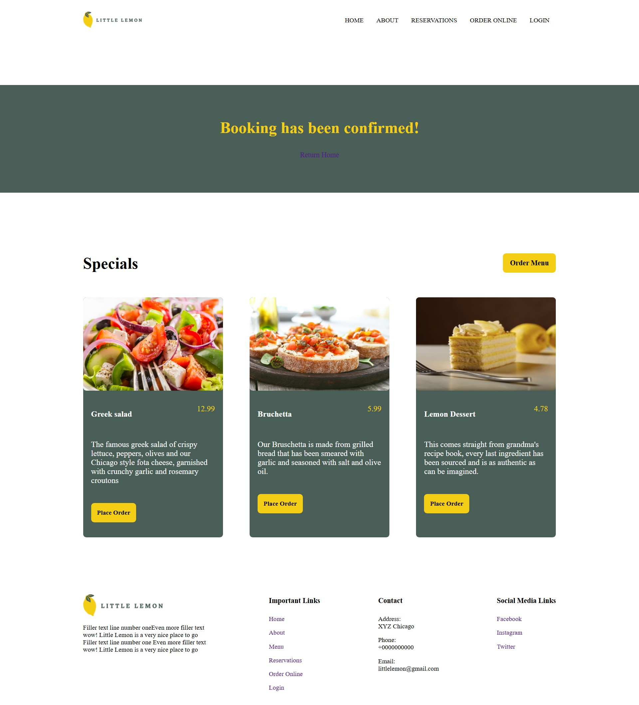
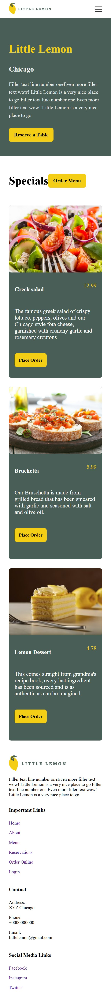
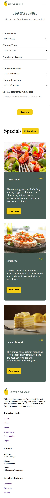

# Meta Frontend Capstone - WebApp

Welcome to the **Meta Frontend Capstone WebApp**! This project was developed as part of the Coursera Meta Frontend Developer Capstone course. The primary goal of this web application was to demonstrate advanced frontend development skills, including responsive design, accessibility, and state management.

## Important Notice 🚨

Please note that **only the "Reserve a Table" feature is functional**. The rest of the pages are static and serve as placeholders for demonstration purposes.

## Tech Stack

This project was built using the following technologies:
- **React** for building the user interface
- **React Router** for navigation
- **CSS/SCSS** for styling
- **Formik** for handling form inputs and validation in the "Reserve a Table" feature

## Screenshots
### Monitor
#### Home Page

#### Reservation Page

#### Use of inline client-side validation

#### Confirmation of Booking

### Mobile
#### Home Page

#### Reservation Page

## Acknowledgments

This project is part of the **Meta Frontend Developer Capstone Course** on [Coursera](https://www.coursera.org/). Special thanks to Meta and Coursera for providing the resources and guidance to complete this project.

---

Happy Coding! 🚀